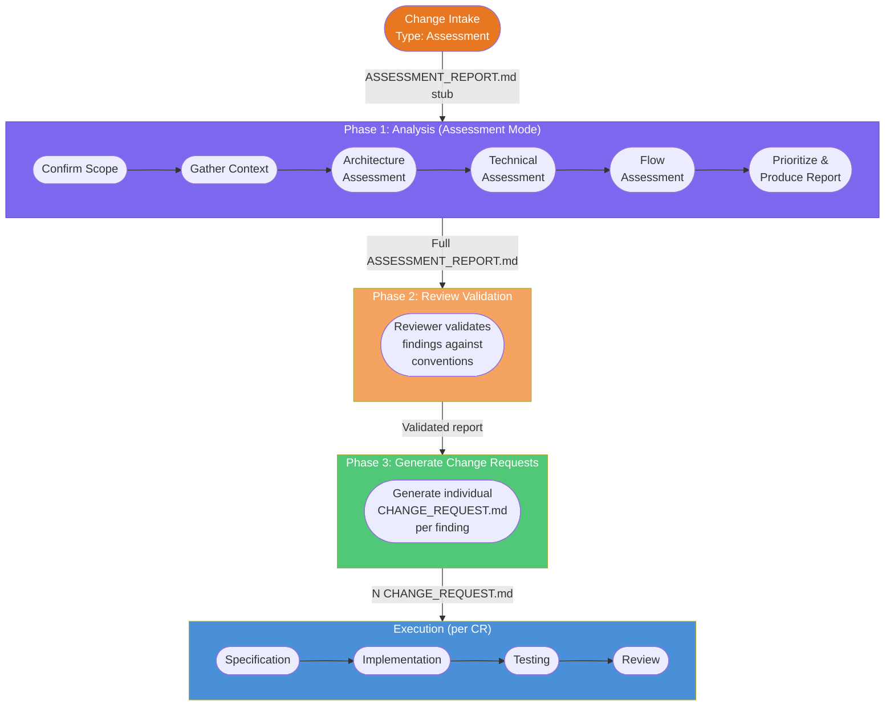
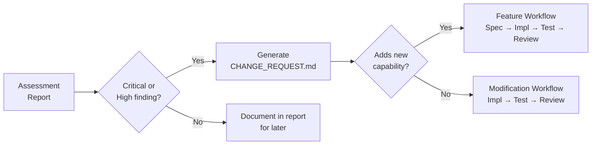

# Assessment Workflow — Auditing Existing Projects

> **Document type:** Framework documentation  
> **Audience:** Developers and AI agents using PovoAgent  
> **Scope:** Describes the end-to-end Assessment workflow for analyzing existing projects to identify architectural, technical, and flow improvements.

---

## Overview

The Assessment workflow is an evolutionary lifecycle path that performs a **holistic audit** of an existing project. Unlike other evolutionary workflows (Feature, Modification, Bug Fix, Refactor) which target a single change, Assessment systematically reviews the entire project — or a scoped subset — and produces a prioritized report of findings with concrete recommendations.

**Key differentiators from other workflows:**

| Aspect | Feature / Modification / Bug Fix / Refactor | Assessment |
|---|---|---|
| Trigger | User knows the specific change needed | User wants to discover what should change |
| Input Scope | One feature, one file, one bug | Entire project or dimension (Architecture / Technical / Flows) |
| Output | One `CHANGE_REQUEST.md` or `BUG_REPORT.md` | One `ASSESSMENT_REPORT.md` + optional N `CHANGE_REQUEST.md` |
| Methodology | Convergent (narrow, fix-specific) | Divergent (broad, discover findings) then convergent (generate CRs) |

---

## When to Use

- A user says: "Assess my project for improvements", "Analyze the architecture", "Audit my codebase", "Find technical debt", "Review my API flows".
- The team is inheriting a codebase and needs a health report.
- Before a major refactor or migration, to understand the full scope.
- As part of a periodic code health review cycle.
- When a project shows signs of degradation (slow builds, frequent regressions, mounting bugs).

---

## Workflow Diagram

---

## Phase Breakdown

### Phase 1 — Analysis (Assessment Mode)

| Field | Value |
|---|---|
| Skill | `analysis` (Assessment Mode — Mode 2) |
| Agent | PovoAgent (main) |
| Input | `ASSESSMENT_REPORT.md` stub (metadata from `change-intake`) + project source code |
| Output | `ASSESSMENT_REPORT.md` with all findings filled in |
| Gate | User reviews and approves the Assessment Report |

#### Steps

1. **Confirm Scope** — Full (all dimensions), Architecture only, Technical only, or Flows only.
2. **Gather Context** — Read `PROJECT_INTAKE.md`, `SPEC_*.md`, Design Document, `conventions.md`.
3. **Architecture Assessment** — SOLID compliance, layer/slice boundaries, decoupling, design patterns, folder structure.
4. **Technical Assessment** — Performance, security, maintainability, dependencies, technical debt.
5. **Flow Assessment** — User flows, data flows, API contracts, cross-slice communication, processes.
6. **Prioritize & Produce Report** — Classify each finding by severity, write the Executive Summary, fill all sections.

### Phase 2 — Review Validation

| Field | Value |
|---|---|
| Skill | `review` |
| Agent | PovoAgent (main) + Reviewer sub-agent |
| Input | `ASSESSMENT_REPORT.md` + project conventions |
| Output | Validation: findings confirmed or corrected |
| Gate | No false positives; all findings are accurate |

The reviewer reads the Assessment Report and validates each finding against the project's conventions and architecture style. This ensures the report does not contain false positives (e.g., flagging a pattern as a violation when it's actually the convention).

### Phase 3 — Generate Change Requests

| Field | Value |
|---|---|
| Skill | `change-intake` (invoked per finding) |
| Agent | PovoAgent (main) |
| Input | `ASSESSMENT_REPORT.md` findings |
| Output | Individual `CHANGE_REQUEST.md` per selected finding |
| Gate | User approves each CR |

This phase is **optional** but recommended for Critical and High findings. Each finding that the user wants to act on spawns a `change-intake` conversation to produce a `CHANGE_REQUEST.md`. The CR follows the appropriate evolutionary workflow (Feature or Modification).

### Execution (per CR)

Each generated `CHANGE_REQUEST.md` follows its own workflow:

- **Feature CRs** → Specification → Implementation → Testing → Review
- **Modification CRs** → Implementation → Testing → Review

---

## Assessment Dimensions in Detail

### Architecture Dimension

| Check | What to look for |
|---|---|
| **SOLID — Single Responsibility** | Classes/modules with more than one reason to change. God classes. |
| **SOLID — Open/Closed** | New behavior requiring modification of existing classes instead of extension. |
| **SOLID — Liskov Substitution** | Implementations that cannot replace their interface without changing caller behavior. |
| **SOLID — Interface Segregation** | Interfaces with methods that some consumers don't use. Fat interfaces. |
| **SOLID — Dependency Inversion** | High-level modules depending on low-level implementations directly. |
| **Decoupling (CA)** | Presentation → Infrastructure direct references. Domain with framework imports. |
| **Decoupling (VSA)** | Slice A importing Slice B's handler. Missing cross-slice contracts. |
| **Design Patterns** | Missing Repository, DI, Use Case (CA). Missing Mediator/Handler (VSA). |
| **Folder Structure** | Deviations from `conventions.md`. Inconsistent naming. |

### Technical Dimension

| Check | What to look for |
|---|---|
| **Performance** | N+1 queries, missing caching, blocking operations, large payloads, unindexed queries. |
| **Security** | Missing input validation, exposed secrets, missing auth checks, insecure dependencies, SQL injection. |
| **Maintainability** | Duplicated code, magic numbers, methods > 50 lines, files > 500 lines, deep nesting. |
| **Dependencies** | Outdated packages, unused dependencies, version conflicts, vulnerable transitive deps. |
| **Technical Debt** | TODO/FIXME comments, commented-out code, inconsistent patterns, missing error handling. |

### Flow Dimension

| Check | What to look for |
|---|---|
| **User Flows** | Incomplete journeys, missing edge cases, unclear error feedback, confusing navigation. |
| **Data Flows** | Incorrect transformations, data consistency risks, missing validation, silent data loss. |
| **API Contracts** | Unstable contracts, inconsistent error responses, missing versioning, inaccurate docs. |
| **Cross-Slice (VSA)** | Misrouted events, missing handlers, incorrect mediator calls, broken sagas. |
| **Process** | Redundant steps, complex chains that can be simplified, missing idempotency. |

---

## Severity Classification

| Severity | Definition | Examples | Action |
|---|---|---|---|
| **Critical** | Security vulnerability, data loss risk, or architecture violation that blocks releases. | SQL injection, exposed API key in code, Domain layer importing Entity Framework. | Generate CR. Fix immediately. |
| **High** | Significant technical debt, performance bottleneck, or SOLID violation affecting multiple features. | N+1 query on list endpoint, Presentation directly calling Infrastructure, 200+ line method. | Generate CR. Fix in current cycle. |
| **Medium** | Code quality issue, missing pattern, or convention violation with localized impact. | Missing interface on a single-use dependency, inconsistent naming in one module. | Optional CR. Plan for next cycle. |
| **Low** | Minor improvement, naming suggestion, or optional optimization. | Rename variable for clarity, extract helper, add inline comment. | Document. No CR needed. Fix opportunistically. |

---

## From Findings to Execution

Each `CHANGE_REQUEST.md` generated from an assessment finding includes a reference back to the Assessment Report (`ASMT-<NNN>`) and the finding number, creating full traceability.

---

## Example Conversation Flow

**User:** "Quiero que analices mi proyecto ProductCatalog en busca de mejoras."

**Agent (change-intake):**
> Is this work on an existing project? If so, does the project have a `PROJECT_INTAKE.md` or design documents I can read?

**User:** "Sí, es el proyecto ProductCatalog con .NET y Clean Architecture."

**Agent:** _[Lee PROJECT_INTAKE.md, design docs, conventions.md]_

> What kind of change is this? Assessment — holistic analysis to identify improvements across architecture, technical, and flows.

**User:** "Assessment completo."

**Agent:** _[Continúa con las preguntas de Scope, confirma, genera ASSESSMENT_REPORT.md stub]_

**Agent (analysis — Assessment Mode):**
> I'll now assess the project across three dimensions. Confirming scope: Full assessment of ProductCatalog.
> _[Ejecuta Steps 3-5, produce findings]_
>
> **Executive Summary:** ProductCatalog has strong layer separation (4/5) but shows N+1 query patterns in ProductController (Technical: High) and the Infrastructure layer directly references ASP.NET types (Architecture: Critical). Overall health: 3.5/5.

**User:** "Genera CRs para los Critical y High."

**Agent:** _[Genera CHANGE_REQUEST.md por cada hallazgo seleccionado]_

---

## Cross-Platform Note

The Assessment workflow operates through conversation and code analysis. It has no platform-specific behavior and works identically on Copilot, OpenCode, Claude, Gemini, and any other AI platform.

## Cross-Pattern Note

The assessment reads the active pattern's `conventions.md` to understand what is and isn't a violation. Technology-specific checks (e.g., React hook rules, .NET DI patterns, Flutter widget structure) are derived from the pattern conventions. The assessment itself is pattern-agnostic.

## Relationship to Other Skills

| Skill | Role in Assessment |
|---|---|
| `change-intake` | Entry point. Produces `ASSESSMENT_REPORT.md` stub with metadata. Also invoked per finding to generate individual CRs. |
| `analysis` (Mode 2) | Core assessment execution. Reviews architecture, technical, and flow dimensions. |
| `review` | Validates findings against conventions to eliminate false positives. |
| `specification` | Invoked if a generated CR is a Feature type (new capability). |
| `implementation` | Invoked per generated CR to apply the fix or build the feature. |
| `testing` | Invoked per generated CR to validate the fix or feature. |

---

## Artifacts Produced

| Artifact | When | Description |
|---|---|---|
| `ASSESSMENT_REPORT.md` | End of Phase 1 | Full report with Executive Summary, findings across all dimensions, prioritized recommendations. |
| `CHANGE_REQUEST.md` (×N) | Phase 3 (optional) | One per selected finding. Linked back to the Assessment Report. |
| Review validation notes | End of Phase 2 | Confirmation that all findings are accurate and not false positives. |

---

## Milestone Tracking

Assessment progress is tracked through:
1. The Assessment Report's **Approval** checklist.
2. The **Generated Change Requests** table (status of each CR).
3. If the project has a `PROJECT_PLAN.md`, the Assessment phase is added as a milestone entry.
