# Evolutionary Lifecycle

## Overview

This document describes the lightweight workflows for working on **existing projects** using the PovoAgent framework. Unlike the full 8-phase new-project lifecycle, evolutionary work uses shorter, focused paths depending on the type of change.

The entry point for all work on existing projects is the `change-intake` skill, which determines the change type and routes to the appropriate workflow.

---

## Entry Point: Change Intake

When a user wants to work on an existing project, the agent invokes `change-intake` instead of `kickoff`. The intake conversation covers four blocks:

1. **Existing Project Context** — Which project? What stack? What architecture?
2. **Change Type and Motivation** — New feature, modification, bug fix, or refactor? Why?
3. **Scope and Impact** — What features, layers, slices, and files are affected?
4. **Risks and Verification** — What tests exist? What could break? How to rollback?

The intake produces either a `CHANGE_REQUEST.md` or a `BUG_REPORT.md`, and the change type determines which lightweight workflow follows.

---

## Workflow Overview

```mermaid
flowchart TB
    CI([Change Intake]) --> |New Feature| WF1
    CI --> |Modification| WF2
    CI --> |Bug Fix| WF3
    CI --> |Refactor| WF4

    subgraph WF1 ["Feature (4 phases)"]
        direction LR
        SP([Specification]) --> IM1([Implementation]) --> TE1([Testing]) --> RE1([Review])
    end

    subgraph WF2 ["Modification (3 phases)"]
        direction LR
        IM2([Implementation]) --> TE2([Testing]) --> RE2([Review])
    end

    subgraph WF3 ["Bug Fix (4 phases)"]
        direction LR
        DX([Diagnosis]) --> IM3([Implementation]) --> TE3([Testing]) --> RE3([Review])
    end

    subgraph WF4 ["Refactor (4 phases)"]
        direction LR
        REpre([Pre-Review]) --> IM4([Implementation]) --> TE4([Testing]) --> REpost([Post-Review])
    end

    style CI fill:#e87722,color:#fff,stroke:#c05a10
    style SP fill:#7b68ee,color:#fff
    style IM1 fill:#50c878,color:#fff
    style TE1 fill:#f4a460,color:#fff
    style RE1 fill:#f4a460,color:#fff
    style DX fill:#7b68ee,color:#fff
    style IM2 fill:#50c878,color:#fff
    style TE2 fill:#f4a460,color:#fff
    style RE2 fill:#f4a460,color:#fff
    style IM3 fill:#50c878,color:#fff
    style TE3 fill:#f4a460,color:#fff
    style RE3 fill:#f4a460,color:#fff
    style REpre fill:#f4a460,color:#fff
    style IM4 fill:#50c878,color:#fff
    style TE4 fill:#f4a460,color:#fff
    style REpost fill:#f4a460,color:#fff
```

**Color legend:**
- Orange — Intake
- Purple — Specification / Diagnosis
- Green — Implementation
- Orange-brown — Testing / Review

---

## Workflow A — New Feature on Existing Project

**When:** Adding a new capability that does not exist in the project.

**Duration:** 4 phases (Specification → Implementation → Testing → Review)

| # | Phase | Skill | Input | Output | Gate |
|---|---|---|---|---|---|
| 1 | Specification | `specification` + `<pattern>-spec` | `CHANGE_REQUEST.md` + Design docs | `SPEC_<Feature>.md` | Spec approved |
| 2 | Implementation | `implementation` + `<pattern>-feature` | Spec + Design docs | Working decoupled code | Feature compiles |
| 3 | Testing | `testing` + `<pattern>-testing` | Spec + Code | Test suite + reports | Coverage met |
| 4 | Review | `review` + Reviewer agent | Code + Conventions | Review report | No blocking violations |

**Note:** This is the same as the lower half of the new-project lifecycle (phases 5–8), skipping Kickoff, Planning, Analysis, Design, and Scaffold. The existing project already has these artifacts.

**When to add phases:** If the new feature requires new contracts or API changes, insert `design` between Specification and Implementation. If the feature introduces a new architectural concern, insert `analysis` between Change Intake and Specification.

---

## Workflow B — Modification to Existing Feature

**When:** Changing the behavior, UI, or logic of an existing feature without adding a new one.

**Duration:** 3 phases (Implementation → Testing → Review)

| # | Phase | Skill | Input | Output | Gate |
|---|---|---|---|---|---|
| 1 | Implementation | `implementation` + `<pattern>-feature` | `CHANGE_REQUEST.md` + existing specs | Updated decoupled code | Change compiles |
| 2 | Testing | `testing` + `<pattern>-testing` | Updated specs + Code | Updated tests + regression report | All tests pass |
| 3 | Review | `review` + Reviewer agent | Code + Conventions | Review report | No blocking violations |

**When to add phases:** If the modification changes contracts or APIs, insert `design` before Implementation. If the modification touches multiple features across different layers/slices, insert `analysis` (scoped impact analysis) before Implementation.

---

## Workflow C — Bug Fix

**When:** Correcting unintended or incorrect behavior.

**Duration:** 4 phases (Diagnosis → Implementation → Testing → Review)

| # | Phase | Skill | Input | Output | Gate |
|---|---|---|---|---|---|
| 1 | Diagnosis | `analysis` (scoped to the bug) | `BUG_REPORT.md` + affected code | Root cause + fix strategy | Diagnosis confirmed |
| 2 | Implementation | `implementation` + `<pattern>-feature` | Diagnosis + `BUG_REPORT.md` | Fix applied | Fix compiles |
| 3 | Testing | `testing` + `<pattern>-testing` | Fix + existing tests | Regression tests + fix validation | All tests pass; bug no longer reproducible |
| 4 | Review | `review` + Reviewer agent | Fix + Conventions | Review report | No blocking violations |

**Diagnosis phase details:**

1. Read the bug report (sections 1–4 from the intake).
2. Read the affected source files identified in the bug report.
3. Trace the code path that leads to the observed behavior.
4. Identify the root cause: which line or condition is wrong, and why.
5. Write the **Diagnosis** section of `BUG_REPORT.md`: root cause, fix strategy, affected contracts.
6. Present the diagnosis to the user for confirmation before writing any fix code.

**For trivial bugs** (typo, missing null check, wrong variable name), the diagnosis and fix can happen in a single step. The user can say "just fix it" and skip the formal confirmation gate.

---

## Workflow D — Refactor

**When:** Restructuring code without changing external behavior: improving naming, reducing duplication, applying SOLID, reorganizing folders.

**Duration:** 4 phases (Pre-Review → Implementation → Testing → Post-Review)

| # | Phase | Skill | Input | Output | Gate |
|---|---|---|---|---|---|
| 1 | Pre-Review | `review` + Reviewer agent | Current code + Conventions | Current-state review identifying violations | Violations documented |
| 2 | Implementation | `implementation` + `<pattern>-feature` | Pre-review + `CHANGE_REQUEST.md` | Refactored code (behavior unchanged) | Refactor compiles |
| 3 | Testing | `testing` + `<pattern>-testing` | Refactored code + existing tests | Confirmation: all existing tests pass | No regressions |
| 4 | Post-Review | `review` + Reviewer agent | Refactored code + Conventions | Final review confirming violations resolved | Violations resolved |

**Key rule:** A refactor must not change external behavior. All existing tests must pass after the refactor without modification (unless the tests themselves are part of the refactor target).

---

## Comparison: New Project vs. Existing Project

| Aspect | New Project | Existing Project |
|---|---|---|
| Entry skill | `kickoff` | `change-intake` |
| Output document | `PROJECT_INTAKE.md` | `CHANGE_REQUEST.md` or `BUG_REPORT.md` |
| Phase count | 8 | 3–4 |
| Architecture defined | During kickoff | Already defined (read from existing docs) |
| Stack chosen | During kickoff | Already chosen |
| Scaffold needed | Yes | No |
| Design from scratch | Yes | Only if contracts change |
| Full analysis | Yes | Scoped to the change |

---

## Documents Produced

| Document | Workflow | Description |
|---|---|---|
| `CHANGE_REQUEST.md` | Feature, Modification, Refactor | Scope, motivation, expected state, affected layers/slices, test plan, rollback |
| `BUG_REPORT.md` | Bug Fix | Observed vs expected behavior, reproduction steps, diagnosis, fix strategy, regression tests |
| `SPEC_<Feature>.md` | Feature (new on existing) | Formal specification for the new feature (same format as new-project specs) |
| Review Report | All workflows | SOLID, decoupling, and convention compliance validation |

---

## Milestone Tracking

For existing projects that have a `PROJECT_PLAN.md`, add completed phases to the milestone checklist as they finish. For projects without a plan, the agent tracks progress through the change request or bug report itself (checkboxes in the Approval and Verification sections).

---

## Pattern Reference

For technology-specific implementation details during evolutionary work, consult:
- The active pattern's `conventions.md` for folder structure, naming, and defaults.
- The pattern's `feature` skill (`<pattern>-feature`) for implementation procedures.
- The pattern's `testing` skill (`<pattern>-testing`) for test stack and procedures.
- The pattern's Reviewer agent for review criteria specific to the technology.
