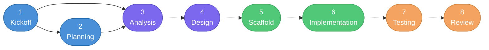

# New Project Lifecycle

## Overview

This document describes the complete end-to-end lifecycle for starting a new project with the PovoAgent framework. It covers every phase from initial information gathering to final code review, including the agents, skills, outputs, and acceptance gates at each step.

The lifecycle is technology-agnostic (works with any pattern: Flutter, React, Angular, .NET, Astro, or other) and platform-agnostic (works on any AI platform: Copilot, OpenCode, Claude, Gemini, or other).

---

## Lifecycle Diagram



**Color legend:**
- Blue — Project initialization phases
- Purple — Architecture phases
- Green — Build phases
- Orange — Validation phases

---

## Phase Reference

### Phase 1 — Kickoff

| Field | Value |
|---|---|
| Skill | `kickoff` |
| Agent | PovoAgent (main) |
| Input | User conversation |
| Output | `PROJECT_INTAKE.md` |
| Gate | User confirms intake document |

**Purpose:** Gather all information needed to initialize the project through a guided, interactive conversation. The conversation is structured in 5 blocks (Project Identity, Users and Context, Scope and Constraints, Technology and Platform, Team and Risks). After all questions are answered, the user confirms a summary before the intake document is generated.

**Output structure:** `PROJECT_INTAKE.md` at the project root, containing project name, description, goal, users, scope, technology stack, team size, and known risks.

**Cross-platform note:** Pure conversation. No platform-specific behavior.

---

### Phase 2 — Planning

| Field | Value |
|---|---|
| Skill | `planning` |
| Agent | PovoAgent (main) |
| Input | `PROJECT_INTAKE.md` + Analysis Plan |
| Output | `PROJECT_PLAN.md` |
| Gate | User approves the project plan |

**Purpose:** Transform the intake document and analysis into a structured project plan with a Mermaid lifecycle diagram, a phase table (with inputs, outputs, owner skills/agents, and gates), a milestone checklist, and a risk register.

**Output structure:** `PROJECT_PLAN.md` at the project root. The milestone checklist in this document is updated as phases complete throughout the project.

**Note:** Planning and Analysis are intentionally close together. The Planning skill reads the Analysis Plan as an input, which means Analysis runs first even though Planning appears earlier in the numbered list. In practice, the agent may run a lightweight analysis pass, then produce the plan, before returning for a full analysis pass if needed.

---

### Phase 3 — Analysis

| Field | Value |
|---|---|
| Skill | `analysis` |
| Agent | PovoAgent (main) |
| Input | `PROJECT_INTAKE.md` |
| Output | Analysis Plan document |
| Gate | Analysis Plan reviewed before Design |

**Purpose:** Expand the intake into a formal analysis plan: functional and non-functional requirements, main use cases, user flows, layer boundaries (presentation / business logic / backend), risk identification, and dependencies.

**Output structure:** `docs/analysis-plan.md` (or equivalent per project convention).

---

### Phase 4 — Design

| Field | Value |
|---|---|
| Skill | `design` |
| Agent | PovoAgent + **Architect** sub-agent |
| Input | Analysis Plan document |
| Output | Architecture document + API contracts + Data models |
| Gate | Design approved before Scaffold |

**Purpose:** Define the decoupled architecture (layers, communication, API contracts, data models, decoupling strategy). The **Architect** sub-agent is read-only and produces the architecture document. UI/UX prototypes or wireframes are optional but recommended.

**SOLID at this phase:** Layer boundaries enforce Dependency Inversion. Contracts enforce Interface Segregation. Each layer has a Single Responsibility.

**Output structure:** `docs/architecture.md`, `docs/api-contracts.md`, `docs/data-models.md`.

---

### Phase 5 — Scaffold

| Field | Value |
|---|---|
| Skill | `<pattern>-scaffold` (e.g., `flutter-scaffold`, `react-scaffold`) |
| Agent | PovoAgent (main) |
| Input | Design documents |
| Output | Initialized project with correct folder and layer structure |
| Gate | Project compiles with correct structure |

**Purpose:** Initialize the project using the technology pattern's scaffold skill. Creates the folder structure, base files, configuration, and dependency manifest reflecting the designed architecture before any feature code is written.

**Cross-pattern note:** Each technology pattern provides its own scaffold skill under `<pattern>/skills/<pattern>-scaffold/SKILL.md`. The scaffold skill reads the design documents and the pattern's `conventions.md` to produce the correct structure.

**Acceptance:** The project compiles or runs (even if empty) and the folder structure matches the architecture document.

---

### Phase 6 — Implementation

| Field | Value |
|---|---|
| Skill | `implementation` + `<pattern>-feature` |
| Agent | PovoAgent (main) |
| Input | Design documents (architecture, API contracts, data models) |
| Output | Working decoupled code for all core features |
| Gate | All core features implemented; layers compile independently |

**Purpose:** Build the application feature by feature. The `implementation` lifecycle skill governs the overall process and enforces decoupling rules. The pattern-specific `feature` skill handles the technology-specific code generation for each feature across all layers (domain → application → infrastructure → presentation).

**SOLID at this phase:** Every class has one responsibility. Constructors receive abstractions. New behavior is added by extension. All implementations are substitutable for their interfaces.

**Decoupling rule:** Presentation has no direct reference to Infrastructure. Business logic has no UI imports.

---

### Phase 7 — Testing

| Field | Value |
|---|---|
| Skill | `testing` + `<pattern>-testing` |
| Agent | PovoAgent (main) |
| Input | Implementation code + Design documents |
| Output | Test plan, test suite, test report, decoupling validation report |
| Gate | Coverage threshold met; decoupling validation passes |

**Purpose:** Validate behavior per layer with unit tests, integration tests, and a decoupling validation (UI swap test). The lifecycle `testing` skill defines the test strategy; the pattern-specific `testing` skill provides technology-specific test commands, mocking libraries, and coverage tooling.

**Required tests:**
- Unit tests for every business logic use case (no UI dependencies).
- Unit tests for presentation (mocked business logic).
- Integration tests for API contracts.
- Decoupling validation: swap UI components and confirm business logic tests still pass.

---

### Phase 8 — Review

| Field | Value |
|---|---|
| Skill | `review` |
| Agent | PovoAgent + **Reviewer** sub-agent |
| Input | Implementation code + Design documents + `conventions.md` |
| Output | Review Report (SOLID violations, decoupling violations, convention violations) |
| Gate | No blocking violations remain |

**Purpose:** Perform a structured code review validating SOLID compliance, layer decoupling, naming conventions, folder structure, and correct application of required design patterns (Repository, DI, Use Case). The **Reviewer** sub-agent is read-only.

**Violation severities:**
- `blocking` — Must be fixed before the feature is complete.
- `warning` — Technical debt; should be fixed.
- `suggestion` — Improvement opportunity with no immediate risk.

---

## Artifact Map

| Artifact | Created in Phase | Location |
|---|---|---|
| `PROJECT_INTAKE.md` | Kickoff | Project root |
| `PROJECT_PLAN.md` | Planning | Project root |
| Analysis Plan | Analysis | `docs/analysis-plan.md` |
| Architecture document | Design | `docs/architecture.md` |
| API contracts | Design | `docs/api-contracts.md` |
| Data models | Design | `docs/data-models.md` |
| Project folder structure | Scaffold | Project root |
| Feature code | Implementation | Per pattern conventions |
| Test suite | Testing | Per pattern conventions |
| Test report | Testing | `docs/test-report.md` |
| Review report | Review | `docs/review-report.md` |

---

## Cross-Platform Integration

The lifecycle is platform-agnostic. All phases use Markdown documents and conversation-based interaction, which work identically across all supported AI platforms.

| Platform | Agent file | Special notes |
|---|---|---|
| GitHub Copilot | `.github/agents/povo.agent.md` | Deployed by `deploy.ps1 -Platform copilot` |
| OpenCode | `AGENTS.md` + `opencode.json` | Deployed by `deploy.ps1 -Platform opencode`; frontmatter uses `mode`/`permission` instead of `tools` |
| Claude | `CLAUDE.md` | Deployed by `deploy.ps1 -Platform claude` |
| Gemini | `.gemini/` | Deployed by `deploy.ps1 -Platform gemini` |

---

## Cross-Pattern Integration

Pattern-specific behavior is encapsulated in the pattern's `scaffold`, `feature`, and `testing` skills and its `conventions.md`. The lifecycle phases are identical across patterns; only the technology-specific details change.

| Pattern | Scaffold skill | Feature skill | Testing skill | Conventions |
|---|---|---|---|---|
| Flutter | `flutter/skills/flutter-scaffold/` | `flutter/skills/flutter-feature/` | `flutter/skills/flutter-testing/` | `flutter/conventions.md` |
| React | `react/skills/react-scaffold/` | `react/skills/react-feature/` | `react/skills/react-testing/` | `react/conventions.md` |
| Angular | `angular/skills/angular-scaffold/` | `angular/skills/angular-feature/` | `angular/skills/angular-testing/` | `angular/conventions.md` |
| .NET | `dotnet/skills/dotnet-scaffold/` | `dotnet/skills/dotnet-feature/` | `dotnet/skills/dotnet-testing/` | `dotnet/conventions.md` |
| Astro | `astro/skills/astro-scaffold/` | `astro/skills/astro-feature/` | `astro/skills/astro-testing/` | `astro/conventions.md` |

---

## Milestone Checklist Template

When the Planning phase produces `PROJECT_PLAN.md`, it includes the following checklist. The agent marks milestones as phases complete.

- [ ] **M1** — Kickoff complete: `PROJECT_INTAKE.md` confirmed by user.
- [ ] **M2** — Analysis complete: Analysis Plan reviewed and approved.
- [ ] **M3** — Plan approved: `PROJECT_PLAN.md` confirmed by user.
- [ ] **M4** — Design approved: Architecture and API contracts approved.
- [ ] **M5** — Scaffold complete: Project compiles with correct layer structure.
- [ ] **M6** — Implementation complete: All core features implemented and decoupled.
- [ ] **M7** — Tests passing: All unit and integration tests pass; coverage met.
- [ ] **M8** — Review approved: No blocking violations remain.

---

## Deploying the Lifecycle to a Project

Use the deploy script to copy the framework (platform instructions + lifecycle skills + pattern skills) into a target project:

```powershell
# Windows
.\deploy.ps1 -Platform copilot -Pattern flutter -Target C:\Projects\MyApp

# Linux / macOS
./deploy.sh --platform copilot --pattern flutter --target ~/projects/MyApp
```

After deployment, the target project contains all lifecycle skills, pattern skills, and the platform-specific agent configuration. Start a new project by invoking PovoAgent and saying **"I have a new project"**.

---

## Files Affected by This Document

| File | Role |
|---|---|
| `skills/kickoff/SKILL.md` | Kickoff phase skill |
| `skills/planning/SKILL.md` | Planning phase skill |
| `skills/analysis/SKILL.md` | Analysis phase skill |
| `skills/design/SKILL.md` | Design phase skill |
| `skills/implementation/SKILL.md` | Implementation phase skill |
| `skills/testing/SKILL.md` | Testing phase skill |
| `skills/review/SKILL.md` | Review phase skill |
| `templates/povo.agent.md` | Main agent template (Copilot) |
| `templates/opencode/povo.agent.md` | Main agent template (OpenCode) |
