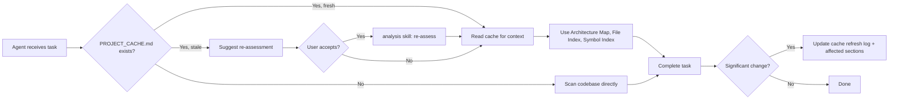

# Project Cache System

> **Status:** Active  
> **Introduced:** 2026-07-02  
> **Applies to:** All platforms (Copilot, Claude, Gemini, OpenCode)  
> **Core template:** `templates/project-cache.md`

---

## Overview

The Project Cache System provides a persistent, structured snapshot of a target project's architecture, domain model, file layout, and symbol index. It eliminates redundant codebase scanning by caching the project's structure so that all skills and agents can read it instead of re-scanning the entire project tree on every interaction.

Without the cache, every agent invocation that needs to understand the project (find files, locate symbols, understand architecture) must scan directories, grep for patterns, and read files to reconstruct context — costing 5–15 tool calls per interaction. With the cache, that context is available in a single file read.

## How It Works

## Cache File

The cache is stored as `PROJECT_CACHE.md` in the project root directory (alongside `PROJECT_INTAKE.md`, `PROJECT_PLAN.md`, etc.).

### Template

The cache follows the schema defined in `templates/project-cache.md`. The template includes:

- **Staleness Header** — Quick-read freshness indicator at the top
- **Metadata** — Project identity, dates, architecture style
- **Architecture Map** — Layer overview (Clean Architecture) or Slice overview (Vertical Slice Architecture)
- **Domain Map** — Aggregate roots, domain services, business rules
- **Symbol Index** — Quick lookup of classes, interfaces, services, providers, contracts, and routes
- **Import / Export Map** — Package-level and cross-module dependencies
- **File Index** — Config files, key directories, test files
- **Key Decisions & Constraints** — Architecture decisions, known constraints
- **Cache Refresh Log** — Full audit trail of all cache updates

## Lifecycle

### Creation

The cache is first created by the `analysis` skill in **Mode 2 (Existing Project Assessment)**. After completing the assessment of a project, the skill generates a full `PROJECT_CACHE.md` by populating the template with real project data.

### Reading

Any skill that needs to examine the codebase should follow this order:

1. **Check** if `PROJECT_CACHE.md` exists in the project root.
2. **If fresh** (Last Updated ≤ 30 days ago): Read the cache and use it as the primary source. Use the **Symbol Index** to locate specific files instead of grepping. Use the **File Index** to find directories and file counts. Use the **Architecture Map** to understand layer/slice structure.
3. **If stale** (Last Updated > 30 days ago): Ask the user if they want a re-assessment. If they decline, use the stale cache — it remains useful despite potential drift.
4. **If absent**: Proceed without it. After completing the task, suggest generating one.

### Incremental Update

After a significant change (new feature, modification that adds files/types, refactor, new slice/layer), the completing skill or agent should:

1. Append a new entry to the **Cache Refresh Log** with:
   - Current date
   - Trigger (what change caused the update)
   - Assessment ID (if available)
   - Changes summary (what files, symbols, or structure changed)
2. Update the **Symbol Index** with any new or modified symbols.
3. Update the **File Index** with any new or removed files.

### Full Refresh (Re-Assessment)

When the cache is stale (> 30 days) or the project has undergone major restructuring, the `analysis` skill performs a full regeneration. Previous entries in the Cache Refresh Log are preserved.

### Stale Detection

The cache template embeds a **Stale After** date (Last Updated + 30 days) and a **Staleness** header that reads "Fresh" or "Stale". Any skill that reads the cache can instantly determine freshness without additional tool calls.

## Cache Freshness Rules

| State | Condition | Action |
|---|---|---|
| **Fresh** | Last Updated ≤ 30 days | Use cache as primary source |
| **Stale** | Last Updated > 30 days | Suggest re-assessment; use cache if declined |
| **Missing** | File does not exist | Scan directly; suggest generation after task |

## What the Cache Reduces

Without the cache, an agent performing a typical task needs:

1. `list_dir` on root — discover project structure
2. `list_dir` on key directories — discover file layout
3. `grep_search` for specific symbols — find where classes are defined
4. `read_file` on config files — understand dependencies
5. `read_file` on key source files — understand architecture

With the cache, this becomes:

1. `read_file` on `PROJECT_CACHE.md` — get everything in one read

Estimated savings: **5–15 tool calls per interaction**, which translates to faster responses and lower token usage.

## Files Affected

| File | Role |
|---|---|
| `templates/project-cache.md` | Core cache schema template |
| `templates/povo.agent.md` | Main agent template with cache lifecycle rules |
| `skills/analysis/SKILL.md` | Cache generation (Mode 2, Step 8) |
| `skills/change-intake/SKILL.md` | Cache reading (Pre-Intake Check) |
| `skills/design/SKILL.md` | Cache reading (Pre-Step) |
| `skills/implementation/SKILL.md` | Cache reading (Pre-Step) + incremental update |
| `skills/testing/SKILL.md` | Cache reading (Pre-Step) |
| `skills/review/SKILL.md` | Cache reading (Pre-Step) |
| `skills/specification/SKILL.md` | Cache reading (Pre-Step) |
| `platforms/copilot/.github/copilot-instructions.md` | Platform-specific cache instructions |
| `platforms/claude/CLAUDE.md` | Platform-specific cache instructions |
| `platforms/gemini/.gemini/styleguide.md` | Platform-specific cache instructions |
| `platforms/opencode/AGENTS.md` | Platform-specific cache instructions |
| `platforms/opencode/opencode.json` | OpenCode instructions list (references PROJECT_CACHE.md) |
| `Docs/project-cache-system.md` | This documentation |

## Migration Guide

### For Existing Projects

If a project was created before the cache system was introduced, the first time the `analysis` skill runs in Assessment Mode, it will generate `PROJECT_CACHE.md`. No manual migration is needed.

### For New Projects

The `PROJECT_CACHE.md` is generated during the Assessment phase. New projects using the full lifecycle (Kickoff → Analysis → Design → ...) will get their cache when they reach the Assessment stage.

### Manual Generation

To generate a cache for an existing project without running a full assessment:

1. Copy `templates/project-cache.md` to the project root as `PROJECT_CACHE.md`.
2. Fill in the Metadata section.
3. Populate the Architecture Map, Domain Map, Symbol Index, and File Index based on the project's actual structure.
4. Set the **Stale After** date to 30 days from creation.
5. Add an entry to the Cache Refresh Log.

## Design Decisions

| Decision | Rationale |
|---|---|
| **Markdown format** | Human-readable, diffable in Git, works across all AI platforms without special parsing |
| **Machine-generated** | Ensures consistency; manual edits would be overwritten |
| **30-day freshness window** | Balances accuracy with update frequency; aligns with typical sprint/release cycles |
| **Incremental updates** | Avoids full re-generation for small changes; skills only update what they touched |
| **Per-project, not per-skill** | Single cache per project avoids duplication and inconsistency |
| **Symbol Index** | Most impactful addition — eliminates grep-based symbol location |
