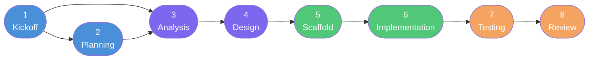

# Guía Completa: De Cero a Producción con PovoAgent

> **Proyecto de ejemplo:** API de catálogo de productos — `ProductCatalog.API`  
> **Patrón:** .NET + Clean Architecture  
> **Plataforma:** GitHub Copilot  
> **Audiencia:** Desarrollador que usa PovoAgent por primera vez

---

## Introducción

Esta guía recorre las 8 fases del ciclo de vida de PovoAgent usando un proyecto ficticio pero realista: una Web API REST en .NET para gestionar un catálogo de productos. Cada fase muestra exactamente qué conversación ocurre con el agente, qué archivos se producen, y cómo se pasa el resultado a la siguiente fase.

Al terminar, el proyecto tendrá:
- Una API REST con endpoints CRUD para productos y categorías.
- Arquitectura Clean con 4 capas (Domain, Application, Infrastructure, Presentation).
- Tests unitarios e integración.
- Un informe de revisión validando SOLID y desacoplamiento.

---

## Ciclo de vida completo



---

## Fase 1 — Kickoff

**Skill:** `kickoff`  
**Input:** Conversación con el usuario  
**Output:** `PROJECT_INTAKE.md`  
**Gate:** Usuario confirma el documento de intake

### Cómo iniciar

En el chat del agente escribe:

> "Tengo un proyecto nuevo. Quiero construir una API de catálogo de productos."

El agente carga el skill `kickoff` y comienza la entrevista guiada:

---

**Agente:** ¿Cómo se llama este proyecto?  
**Usuario:** ProductCatalog

**Agente:** En una o dos frases, ¿qué hace este proyecto?  
**Usuario:** Es una Web API REST que permite gestionar un catálogo de productos con categorías, precios e inventario.

**Agente:** ¿Cuál es el objetivo principal, el resultado más importante que debe lograr?  
**Usuario:** Que otras aplicaciones (una app móvil y un panel web) puedan consultar y administrar el catálogo de productos en tiempo real.

**Agente:** ¿Quiénes son los usuarios principales?  
**Usuario:** Dos tipos: administradores de tienda que gestionan el catálogo, y aplicaciones cliente (app móvil y panel web) que consumen la API.

**Agente:** ¿Qué problemas o necesidades resuelve para esos usuarios?  
**Usuario:** Los admins necesitan un lugar centralizado para mantener precios y stock actualizados. Las apps clientes necesitan un contrato estable y rápido para mostrar productos.

**Agente:** ¿Es un producto nuevo, una mejora de algo existente, o un reemplazo?  
**Usuario:** Producto nuevo desde cero.

**Agente:** Lista las 3–5 funcionalidades imprescindibles para la primera versión.  
**Usuario:**
1. CRUD de productos (nombre, descripción, precio, stock, imagen URL)
2. CRUD de categorías
3. Asignación de categoría a producto
4. Búsqueda y filtrado de productos por categoría y nombre
5. Autenticación básica con JWT para endpoints de escritura

**Agente:** ¿Hay algo explícitamente fuera de alcance?  
**Usuario:** Sin pasarela de pagos, sin carrito de compras, sin notificaciones.

**Agente:** ¿Requisitos no funcionales conocidos (rendimiento, seguridad, accesibilidad, normativa)?  
**Usuario:** Los endpoints de lectura deben responder en menos de 200ms. JWT para proteger escrituras. No hay normativa específica.

**Agente:** ¿Hay algún deadline o ventana objetivo?  
**Usuario:** Primera versión en 3 semanas.

**Agente:** ¿Qué patrón tecnológico aplica?  
**Usuario:** dotnet

**Agente:** ¿Qué plataforma AI usarás?  
**Usuario:** copilot

**Agente:** ¿Integraciones externas conocidas?  
**Usuario:** Base de datos PostgreSQL. Sin APIs externas por ahora.

**Agente:** ¿Cuántos desarrolladores trabajarán en esto?  
**Usuario:** 2

**Agente:** ¿Riesgos o bloqueos conocidos?  
**Usuario:** El esquema de base de datos aún no está definido. Puede cambiar durante el diseño.

---

**Agente:** Aquí está el resumen. ¿Es correcto?

> **Proyecto:** ProductCatalog — API REST .NET para catálogo de productos  
> **Objetivo:** Servir de backend centralizado para app móvil y panel web  
> **Usuarios:** Admins de tienda + aplicaciones cliente  
> **Features:** CRUD productos, CRUD categorías, asignación, búsqueda/filtrado, JWT  
> **Fuera de alcance:** Pagos, carrito, notificaciones  
> **Stack:** .NET / Clean Architecture + PostgreSQL  
> **Plataforma:** Copilot | **Equipo:** 2 | **Timeline:** 3 semanas  
> **Riesgo:** Esquema DB no definido todavía

**Usuario:** Correcto.

---

### Documento generado: `PROJECT_INTAKE.md`

```markdown
# Project Intake Document

## Project Identity
- **Name:** ProductCatalog
- **Description:** Web API REST para gestionar un catálogo de productos con categorías, precios e inventario.
- **Main Goal:** Servir de backend centralizado para una app móvil y un panel web que consumen el catálogo en tiempo real.

## Users and Context
- **Target Users:** Administradores de tienda (escritura) + aplicaciones cliente (lectura)
- **User Problems:** Necesidad de un lugar centralizado y un contrato API estable
- **Business Context:** Nuevo producto desde cero

## Scope
- **Core Features:**
  1. CRUD de productos (nombre, descripción, precio, stock, imagen URL)
  2. CRUD de categorías
  3. Asignación de categoría a producto
  4. Búsqueda y filtrado por categoría y nombre
  5. Autenticación JWT para endpoints de escritura
- **Out of Scope:** Pasarela de pagos, carrito de compras, notificaciones
- **Non-Functional Requirements:** Lectura < 200ms; JWT en endpoints de escritura
- **Timeline:** 3 semanas

## Technology Stack
- **Pattern:** dotnet
- **AI Platform:** copilot
- **External Integrations:** PostgreSQL

## Team and Risks
- **Team Size:** 2
- **Known Risks / Blockers:** Esquema de base de datos no definido; puede cambiar durante el diseño

## Approval
- [x] Kickoff confirmed by user
```

---

## Fase 2 — Planning

**Skill:** `planning`  
**Input:** `PROJECT_INTAKE.md` + Analysis Plan  
**Output:** `PROJECT_PLAN.md`  
**Gate:** Usuario aprueba el plan

> El agente lee el intake y genera el plan estructurado. El usuario lo revisa y aprueba antes de que comience el Diseño.

### Documento generado: `PROJECT_PLAN.md`

```markdown
# Project Plan — ProductCatalog

## Summary

| Field     | Value                                     |
|-----------|-------------------------------------------|
| Project   | ProductCatalog                            |
| Goal      | Backend centralizado para apps cliente    |
| Pattern   | dotnet (Clean Architecture)               |
| Platform  | copilot                                   |
| Team      | 2 developers                              |
| Target    | 3 semanas                                 |

## Lifecycle

flowchart LR
    KO([Kickoff]) --> PL([Planning])
    PL --> AN([Analysis])
    AN --> DE([Design])
    DE --> SC([Scaffold])
    SC --> IM([Implementation])
    IM --> TE([Testing])
    TE --> RE([Review])

## Phase Table

| # | Phase          | Skill / Agent                    | Inputs               | Outputs                      | Gate                     |
|---|----------------|----------------------------------|----------------------|------------------------------|--------------------------|
| 1 | Kickoff        | kickoff                          | Conversación         | PROJECT_INTAKE.md            | Usuario confirma         |
| 2 | Planning       | planning                         | Intake + Analysis    | PROJECT_PLAN.md              | Usuario aprueba          |
| 3 | Analysis       | analysis                         | Intake               | docs/analysis-plan.md        | Plan revisado            |
| 4 | Design         | design + dotnet-architect        | Analysis Plan        | docs/architecture.md + APIs  | Diseño aprobado          |
| 5 | Scaffold       | dotnet-scaffold                  | Design docs          | Solución .NET estructurada   | Proyecto compila         |
| 6 | Implementation | implementation + dotnet-feature  | Design docs          | Código desacoplado           | Features completas       |
| 7 | Testing        | testing + dotnet-testing         | Código + Design      | Suite de tests + reporte     | Cobertura alcanzada      |
| 8 | Review         | review + dotnet-reviewer         | Código + Conventions | Review report                | Sin bloqueos             |

## Milestones

- [x] M1 — Kickoff completo: PROJECT_INTAKE.md confirmado
- [ ] M2 — Analysis completo: docs/analysis-plan.md aprobado
- [ ] M3 — Plan aprobado: PROJECT_PLAN.md confirmado
- [ ] M4 — Diseño aprobado: arquitectura y contratos API aprobados
- [ ] M5 — Scaffold completo: solución compila con estructura correcta
- [ ] M6 — Implementación completa: todas las features implementadas
- [ ] M7 — Tests pasando: cobertura y validación de desacoplamiento OK
- [ ] M8 — Review aprobado: sin bloqueos

## Risk Register

| Risk                          | Impact | Mitigation                                              |
|-------------------------------|--------|---------------------------------------------------------|
| Esquema DB no definido        | Medium | Definir schema en fase de Design; usar migraciones EF Core |

## Technology Stack

| Layer          | Technology                     |
|----------------|--------------------------------|
| Pattern        | dotnet / Clean Architecture    |
| AI Platform    | copilot                        |
| Database       | PostgreSQL + EF Core           |
| Auth           | JWT (ASP.NET Core Identity)    |

## Approval

- [x] Project Plan confirmed by user
```

---

## Fase 3 — Analysis

**Skill:** `analysis`  
**Input:** `PROJECT_INTAKE.md`  
**Output:** `docs/analysis-plan.md`  
**Gate:** Plan revisado antes del diseño

> El agente expande el intake en un plan de análisis formal: casos de uso, flujos de usuario y límites de capas.

### Fragmento del documento generado: `docs/analysis-plan.md`

```markdown
# Analysis Plan — ProductCatalog

## Functional Requirements

| ID  | Requirement                                            | Priority |
|-----|--------------------------------------------------------|----------|
| F01 | Crear, leer, actualizar y eliminar productos           | Must     |
| F02 | Crear, leer, actualizar y eliminar categorías          | Must     |
| F03 | Asignar una categoría a un producto                    | Must     |
| F04 | Buscar productos por nombre (búsqueda parcial)         | Must     |
| F05 | Filtrar productos por categoría                        | Must     |
| F06 | Proteger endpoints de escritura con JWT                | Must     |

## Non-Functional Requirements

| ID   | Requirement                                  | Metric              |
|------|----------------------------------------------|---------------------|
| NF01 | Tiempo de respuesta en lectura               | < 200ms p95         |
| NF02 | Autenticación en escritura                   | JWT Bearer          |
| NF03 | Sin regresiones al agregar features          | Tests automatizados |

## Main Use Cases

### UC01 — Gestionar Productos (Admin)
1. Admin se autentica y obtiene JWT.
2. Admin crea un producto con nombre, descripción, precio, stock e imagen.
3. Admin edita precio o stock de un producto existente.
4. Admin elimina un producto descontinuado.

### UC02 — Consultar Catálogo (App Cliente)
1. App cliente solicita lista de productos (paginada).
2. App cliente filtra por categoría.
3. App cliente busca por nombre parcial.
4. App cliente obtiene detalle de un producto.

### UC03 — Gestionar Categorías (Admin)
1. Admin crea una nueva categoría.
2. Admin asigna categoría a uno o varios productos.
3. Admin elimina una categoría sin productos asignados.

## Layer Boundaries

| Layer          | Responsibility                                    | What it must NOT do                       |
|----------------|---------------------------------------------------|-------------------------------------------|
| Domain         | Entidades, interfaces de repositorio, excepciones | Acceder a DB, importar ASP.NET o EF Core  |
| Application    | Casos de uso, DTOs, validaciones                  | Importar Infrastructure o Presentation    |
| Infrastructure | Repositorios EF Core, DbContext                   | Contener lógica de negocio                |
| Presentation   | Endpoints/Controllers, validación de request      | Importar Infrastructure directamente      |

## Risk Identification

| Risk                         | Mitigation                                              |
|------------------------------|---------------------------------------------------------|
| Schema DB no definido        | Definir entidades en Domain primero; schema se deriva   |
| Performance < 200ms          | Índices en CategoryId y Name; respuestas paginadas      |
```

---

## Fase 4 — Design

**Skill:** `design` + **Architect sub-agent**  
**Input:** `docs/analysis-plan.md`  
**Output:** `docs/architecture.md`, `docs/api-contracts.md`, `docs/data-models.md`  
**Gate:** Diseño aprobado antes del scaffold

### Fragmento: `docs/architecture.md`

```markdown
# Architecture — ProductCatalog

## Layer Diagram

Domain ← Application ← Infrastructure
                    ↑
              Presentation
                    ↑
                  Host

## Dependency Rules
- Domain: sin dependencias externas.
- Application: solo depende de Domain.
- Infrastructure: implementa interfaces de Domain/Application.
- Presentation: solo usa Application (use cases via DI).
- Host: composition root — único lugar que referencia todas las capas.

## API Style
FastEndpoints (elegido por performance y separación de responsabilidades por feature).

## Auth Strategy
JWT Bearer. Endpoints de lectura: anónimos. Endpoints de escritura: [RequireAuthorization].
```

### Fragmento: `docs/api-contracts.md`

```
GET    /api/products                 → 200 ProductListResponse (paginada)
GET    /api/products/{id}            → 200 ProductResponse | 404
POST   /api/products        [Auth]   → 201 ProductResponse | 400 ValidationError
PUT    /api/products/{id}   [Auth]   → 200 ProductResponse | 404 | 400
DELETE /api/products/{id}   [Auth]   → 204 | 404

GET    /api/categories               → 200 CategoryListResponse
POST   /api/categories      [Auth]   → 201 CategoryResponse | 400
DELETE /api/categories/{id} [Auth]   → 204 | 409 (tiene productos asignados)

POST   /api/auth/login               → 200 { token: string, expiresAt: datetime }
```

### Fragmento: `docs/data-models.md`

```
Product
  Id           : Guid        PK
  Name         : string(200) NOT NULL
  Description  : string(1000)
  Price        : decimal(18,2) NOT NULL
  Stock        : int NOT NULL DEFAULT 0
  ImageUrl     : string(500)
  CategoryId   : Guid        FK → Category.Id
  CreatedAt    : datetime    NOT NULL
  UpdatedAt    : datetime    NOT NULL

Category
  Id           : Guid        PK
  Name         : string(100) NOT NULL UNIQUE
  CreatedAt    : datetime    NOT NULL
```

---

## Fase 5 — Scaffold

**Skill:** `dotnet-scaffold`  
**Input:** Design docs  
**Output:** Solución .NET con estructura Clean Architecture  
**Gate:** La solución compila sin errores

> El agente ejecuta los comandos `dotnet` para crear la solución y configura referencias entre proyectos.

### Comandos ejecutados

```bash
# Crear solución
dotnet new sln -n ProductCatalog

# Proyectos por capa
dotnet new classlib -n ProductCatalog.Domain
dotnet new classlib -n ProductCatalog.Application
dotnet new classlib -n ProductCatalog.Infrastructure
dotnet new web -n ProductCatalog.Presentation        # Minimal API base para FastEndpoints

# Agregar a solución
dotnet sln add ProductCatalog.Domain
dotnet sln add ProductCatalog.Application
dotnet sln add ProductCatalog.Infrastructure
dotnet sln add ProductCatalog.Presentation

# Referencias entre capas
dotnet add ProductCatalog.Application reference ProductCatalog.Domain
dotnet add ProductCatalog.Infrastructure reference ProductCatalog.Domain
dotnet add ProductCatalog.Infrastructure reference ProductCatalog.Application
dotnet add ProductCatalog.Presentation reference ProductCatalog.Application

# Paquetes
dotnet add ProductCatalog.Infrastructure package Microsoft.EntityFrameworkCore
dotnet add ProductCatalog.Infrastructure package Npgsql.EntityFrameworkCore.PostgreSQL
dotnet add ProductCatalog.Application package FluentValidation
dotnet add ProductCatalog.Presentation package FastEndpoints
dotnet add ProductCatalog.Presentation package FastEndpoints.Swagger
dotnet add ProductCatalog.Presentation package Microsoft.AspNetCore.Authentication.JwtBearer

# Tests
dotnet new xunit -n ProductCatalog.Domain.Tests
dotnet new xunit -n ProductCatalog.Application.Tests
dotnet new xunit -n ProductCatalog.Infrastructure.Tests
dotnet new xunit -n ProductCatalog.Presentation.Tests
dotnet add ProductCatalog.Application.Tests package NSubstitute
```

### Estructura resultante

```
ProductCatalog/
├── ProductCatalog.Domain/
│   ├── Entities/
│   ├── Interfaces/
│   │   └── IRepository.cs
│   └── Exceptions/
├── ProductCatalog.Application/
│   ├── UseCases/
│   ├── DTOs/
│   └── Interfaces/
├── ProductCatalog.Infrastructure/
│   ├── Persistence/
│   │   └── AppDbContext.cs
│   └── Repositories/
├── ProductCatalog.Presentation/
│   ├── Features/
│   └── Program.cs          ← composition root
└── tests/
    ├── ProductCatalog.Domain.Tests/
    ├── ProductCatalog.Application.Tests/
    ├── ProductCatalog.Infrastructure.Tests/
    └── ProductCatalog.Presentation.Tests/
```

**Verificación:** `dotnet build` → `Build succeeded. 0 Error(s)`. ✓ Gate pasado.

---

## Fase 6 — Implementation

**Skill:** `implementation` + `dotnet-feature`  
**Input:** Design docs (architecture, API contracts, data models)  
**Output:** Código desacoplado y funcional  
**Gate:** Todas las features implementadas; capas compilan independientemente

> El agente implementa feature por feature usando el skill `dotnet-feature`. Aquí se muestra la feature **Productos** como ejemplo.

### Feature: Gestionar Productos

#### Domain layer

```csharp
// ProductCatalog.Domain/Entities/Product.cs
public class Product
{
    public Guid Id { get; private set; }
    public string Name { get; private set; }
    public string? Description { get; private set; }
    public decimal Price { get; private set; }
    public int Stock { get; private set; }
    public string? ImageUrl { get; private set; }
    public Guid CategoryId { get; private set; }
    public DateTime CreatedAt { get; private set; }
    public DateTime UpdatedAt { get; private set; }

    private Product() { } // EF Core

    public static Product Create(string name, decimal price, int stock, Guid categoryId,
        string? description = null, string? imageUrl = null)
    {
        if (string.IsNullOrWhiteSpace(name)) throw new DomainException("Product name is required.");
        if (price < 0) throw new DomainException("Price cannot be negative.");
        if (stock < 0) throw new DomainException("Stock cannot be negative.");

        return new Product
        {
            Id = Guid.NewGuid(),
            Name = name,
            Description = description,
            Price = price,
            Stock = stock,
            ImageUrl = imageUrl,
            CategoryId = categoryId,
            CreatedAt = DateTime.UtcNow,
            UpdatedAt = DateTime.UtcNow
        };
    }

    public void UpdatePrice(decimal newPrice)
    {
        if (newPrice < 0) throw new DomainException("Price cannot be negative.");
        Price = newPrice;
        UpdatedAt = DateTime.UtcNow;
    }
}
```

```csharp
// ProductCatalog.Domain/Interfaces/IProductRepository.cs
public interface IProductRepository
{
    Task<Product?> GetByIdAsync(Guid id, CancellationToken ct = default);
    Task<IReadOnlyList<Product>> GetByCategoryAsync(Guid categoryId, CancellationToken ct = default);
    Task<IReadOnlyList<Product>> SearchByNameAsync(string nameFragment, CancellationToken ct = default);
    Task AddAsync(Product product, CancellationToken ct = default);
    Task UpdateAsync(Product product, CancellationToken ct = default);
    Task DeleteAsync(Guid id, CancellationToken ct = default);
}
```

#### Application layer

```csharp
// ProductCatalog.Application/UseCases/Products/CreateProductUseCase.cs
public sealed class CreateProductUseCase
{
    private readonly IProductRepository _products;
    private readonly ICategoryRepository _categories;

    public CreateProductUseCase(IProductRepository products, ICategoryRepository categories)
    {
        _products = products;
        _categories = categories;
    }

    public async Task<ProductDto> ExecuteAsync(CreateProductRequest request, CancellationToken ct = default)
    {
        var categoryExists = await _categories.ExistsAsync(request.CategoryId, ct);
        if (!categoryExists)
            throw new NotFoundException($"Category {request.CategoryId} not found.");

        var product = Product.Create(
            request.Name, request.Price, request.Stock,
            request.CategoryId, request.Description, request.ImageUrl);

        await _products.AddAsync(product, ct);
        return product.ToDto();
    }
}
```

```csharp
// ProductCatalog.Application/DTOs/ProductDto.cs
public sealed record ProductDto(
    Guid Id,
    string Name,
    string? Description,
    decimal Price,
    int Stock,
    string? ImageUrl,
    Guid CategoryId,
    DateTime CreatedAt,
    DateTime UpdatedAt);
```

#### Infrastructure layer

```csharp
// ProductCatalog.Infrastructure/Repositories/ProductRepository.cs
public sealed class ProductRepository : IProductRepository
{
    private readonly AppDbContext _db;

    public ProductRepository(AppDbContext db) => _db = db;

    public Task<Product?> GetByIdAsync(Guid id, CancellationToken ct) =>
        _db.Products.FirstOrDefaultAsync(p => p.Id == id, ct);

    public async Task<IReadOnlyList<Product>> SearchByNameAsync(string nameFragment, CancellationToken ct) =>
        await _db.Products
            .Where(p => EF.Functions.ILike(p.Name, $"%{nameFragment}%"))
            .AsNoTracking()
            .ToListAsync(ct);

    public async Task AddAsync(Product product, CancellationToken ct)
    {
        await _db.Products.AddAsync(product, ct);
        await _db.SaveChangesAsync(ct);
    }

    // ... GetByCategoryAsync, UpdateAsync, DeleteAsync
}
```

#### Presentation layer (FastEndpoints)

```csharp
// ProductCatalog.Presentation/Features/Products/CreateProduct/CreateProductEndpoint.cs
public class CreateProductEndpoint : Endpoint<CreateProductRequest, ProductDto>
{
    private readonly CreateProductUseCase _useCase;

    public CreateProductEndpoint(CreateProductUseCase useCase) => _useCase = useCase;

    public override void Configure()
    {
        Post("/api/products");
        RequireAuthorization();
    }

    public override async Task HandleAsync(CreateProductRequest req, CancellationToken ct)
    {
        var result = await _useCase.ExecuteAsync(req, ct);
        await SendCreatedAtAsync<GetProductEndpoint>(new { result.Id }, result, cancellation: ct);
    }
}
```

---

## Fase 7 — Testing

**Skill:** `testing` + `dotnet-testing`  
**Input:** Código + Design docs  
**Output:** Suite de tests + reporte + validación de desacoplamiento  
**Gate:** Cobertura mínima alcanzada; validación de desacoplamiento pasa

### Tests unitarios — Application layer

```csharp
// ProductCatalog.Application.Tests/UseCases/CreateProductUseCaseTests.cs
public class CreateProductUseCaseTests
{
    private readonly IProductRepository _products = Substitute.For<IProductRepository>();
    private readonly ICategoryRepository _categories = Substitute.For<ICategoryRepository>();
    private readonly CreateProductUseCase _sut;

    public CreateProductUseCaseTests()
    {
        _sut = new CreateProductUseCase(_products, _categories);
    }

    [Fact]
    public async Task Execute_WhenCategoryExists_CreatesProduct()
    {
        // Arrange
        var categoryId = Guid.NewGuid();
        _categories.ExistsAsync(categoryId, default).Returns(true);
        var request = new CreateProductRequest("Laptop Pro", 1299.99m, 10, categoryId);

        // Act
        var result = await _sut.ExecuteAsync(request);

        // Assert
        result.Name.Should().Be("Laptop Pro");
        result.Price.Should().Be(1299.99m);
        await _products.Received(1).AddAsync(Arg.Any<Product>(), default);
    }

    [Fact]
    public async Task Execute_WhenCategoryNotFound_ThrowsNotFoundException()
    {
        // Arrange
        _categories.ExistsAsync(Arg.Any<Guid>(), default).Returns(false);
        var request = new CreateProductRequest("Laptop", 999m, 5, Guid.NewGuid());

        // Act & Assert
        await _sut.Invoking(s => s.ExecuteAsync(request))
            .Should().ThrowAsync<NotFoundException>();
    }
}
```

### Test de desacoplamiento (Architecture Test)

```csharp
// ProductCatalog.Domain.Tests/ArchitectureTests.cs
public class ArchitectureTests
{
    [Fact]
    public void Domain_ShouldNotDependOn_Infrastructure()
    {
        var domainAssembly = typeof(Product).Assembly;
        var infraAssembly = typeof(ProductRepository).Assembly;

        domainAssembly.GetReferencedAssemblies()
            .Should().NotContain(a => a.Name == infraAssembly.GetName().Name,
                "Domain must not reference Infrastructure.");
    }

    [Fact]
    public void Domain_ShouldNotDependOn_AspNet()
    {
        var domainAssembly = typeof(Product).Assembly;

        domainAssembly.GetReferencedAssemblies()
            .Should().NotContain(a => a.Name!.StartsWith("Microsoft.AspNetCore"),
                "Domain must have no ASP.NET Core dependencies.");
    }
}
```

### Reporte de tests (resumen)

```
ProductCatalog Test Results — ProductCatalog v1.0.0

Layer              Tests   Pass   Fail   Coverage
─────────────────────────────────────────────────
Domain             12      12     0      91%
Application        28      28     0      87%
Infrastructure      9       9     0      74%
Presentation       15      15     0      82%
─────────────────────────────────────────────────
Total              64      64     0      84%

Decoupling Validation: PASSED
  ✓ Domain has no Infrastructure dependency
  ✓ Domain has no ASP.NET Core dependency
  ✓ Application has no Infrastructure dependency
  ✓ Presentation has no Infrastructure dependency
```

---

## Fase 8 — Review

**Skill:** `review` + **Reviewer sub-agent**  
**Input:** Código + `docs/architecture.md` + `dotnet/conventions.md`  
**Output:** `docs/review-report.md`  
**Gate:** Sin bloqueos

### Fragmento: `docs/review-report.md`

```markdown
# Review Report — ProductCatalog v1.0.0

## Scope Reviewed
- ProductCatalog.Domain (Entities, Interfaces, Exceptions)
- ProductCatalog.Application (UseCases/Products, UseCases/Categories, DTOs)
- ProductCatalog.Infrastructure (Repositories, Persistence)
- ProductCatalog.Presentation (Features/Products, Features/Categories, Features/Auth)

## SOLID Compliance

| Principle | Status  | Notes                                                              |
|-----------|---------|--------------------------------------------------------------------|
| S         | ✓ PASS  | Cada use case tiene una sola responsabilidad                       |
| O         | ✓ PASS  | Nuevas features se agregan con clases nuevas                       |
| L         | ✓ PASS  | ProductRepository e InMemoryProductRepository son intercambiables  |
| I         | ✓ PASS  | IProductRepository no tiene métodos no usados por sus clientes     |
| D         | ✓ PASS  | Domain/Application definen interfaces; Infrastructure implementa   |

## Decoupling

| Check                                          | Status |
|------------------------------------------------|--------|
| Domain sin dependencias de Infrastructure      | ✓ PASS |
| Application sin dependencias de Infrastructure | ✓ PASS |
| Presentation sin imports de Infrastructure     | ✓ PASS |
| Host como único composition root               | ✓ PASS |

## Violations

### Blocking (0)
Ninguna.

### Warning (1)
- **W01** `ProductRepository.SearchByNameAsync` — El parámetro `nameFragment` no está siendo sanitizado
  antes de pasarse a `ILike`. Aunque EF Core parametriza la consulta, el fragmento debería ser
  normalizado (trim + toLower) en el use case, no en el repositorio.
  **Sugerencia:** mover normalización a `SearchProductsUseCase`.

### Suggestion (2)
- **S01** `CreateProductEndpoint` — El manejo de `NotFoundException` podría centralizarse en un
  `ExceptionHandler` global de FastEndpoints en lugar de repetirlo por endpoint.
- **S02** `ProductDto` — Considerar agregar `CategoryName` al DTO para evitar un segundo request
  desde el cliente en casos de uso de listado.

## Result: APPROVED
No hay bloqueos. El W01 se recomienda resolver antes del siguiente sprint.
```

---

## Resumen de artefactos producidos

| Artefacto                   | Fase           | Ubicación                       |
|-----------------------------|----------------|---------------------------------|
| `PROJECT_INTAKE.md`         | Kickoff        | Raíz del proyecto               |
| `PROJECT_PLAN.md`           | Planning       | Raíz del proyecto               |
| `docs/analysis-plan.md`     | Analysis       | `docs/`                         |
| `docs/architecture.md`      | Design         | `docs/`                         |
| `docs/api-contracts.md`     | Design         | `docs/`                         |
| `docs/data-models.md`       | Design         | `docs/`                         |
| Estructura de solución .NET | Scaffold       | Raíz del proyecto               |
| Código fuente por capas     | Implementation | Por convención del patrón .NET  |
| Suite de tests              | Testing        | `tests/`                        |
| `docs/review-report.md`     | Review         | `docs/`                         |

---

## Checklist de milestones al cierre

- [x] M1 — Kickoff completo: `PROJECT_INTAKE.md` confirmado
- [x] M2 — Analysis completo: `docs/analysis-plan.md` aprobado
- [x] M3 — Plan aprobado: `PROJECT_PLAN.md` confirmado
- [x] M4 — Diseño aprobado: arquitectura y contratos API aprobados
- [x] M5 — Scaffold completo: solución compila sin errores
- [x] M6 — Implementación completa: CRUD productos y categorías + JWT
- [x] M7 — Tests pasando: 64/64 tests, 84% cobertura, desacoplamiento validado
- [x] M8 — Review aprobado: 0 bloqueos, 1 warning, 2 sugerencias

---

## Próximos pasos

Con el ciclo base completado, la siguiente iteración del proyecto puede comenzar directamente en **Analysis** (para las nuevas features), sin repetir Kickoff ni Scaffold. El agente detecta `PROJECT_INTAKE.md` y `PROJECT_PLAN.md` existentes y actualiza los milestones al finalizar cada fase.
